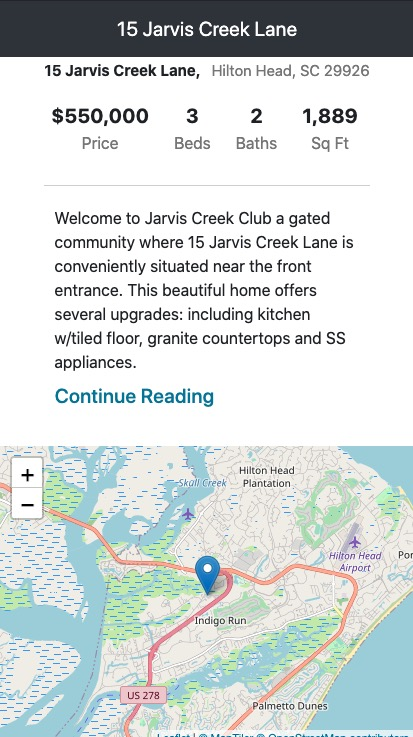

# Jarvis Creek

## Technology used
- React
- Firebase/ Firestore
- Form Validation
- Leaflet Map
- React Responsive Carousel
- Bootstrap
- CSS (Mobile-first responsive design and css variables)

## Project Screen Shots

## Reflection

This project didn't take too long to complete. I was using Redfin Real Estate sites for a rough template. With having a wireframe to follow it makes the project that much easier to complete. 
 

The biggest obstacle that I overcame with this project was adding the map. My first thought was to use a react Google Maps package, but after some research, I found if the website received too many visits, google may charge for the service. With this knowledge, I started looking for free map packages and I quickly found Leaflet Maps. Easy enough so far, I added in the package and the component, but the map wasn't coming in clearly. I knew it was an issue with the CSS and after an extended time I found the errors were due to a cdn version link in the head of the index.html file. To be fair Leaflet maps seem to have multiple revisions and I was twisted between all of the versions. Yes, this took way too much time over a simple error of a cdn link, but I was happy to finally tackle adding a map into a react app! 
 

## Available Scripts
This project was bootstrapped with [Create React App](https://github.com/facebook/create-react-app).

In the project directory, you can run:

### `npm run start`

Runs the app in the development mode. 
Open [http://localhost:3000](http://localhost:3000) to view it in the browser.

The page will reload if you make edits. 
You will also see any lint errors in the console.

### `npm run test`
Launches the test runner in the interactive watch mode. 
See the section about running tests for more information.

### `npm run build`

Builds the app for production to the `build` folder. 
It correctly bundles React in production mode and optimizes the build for the best performance.

The build is minified and the filenames include the hashes. 
Your app is ready to be deployed!

### `npm run eject`

Note: this is a one-way operation. Once you eject, you can’t go back! 

If you aren’t satisfied with the build tool and configuration choices, you can eject at  any time. This command will remove the single build dependency from your project.  

Instead, it will copy all the configuration files and the transitive dependencies  (Webpack, Babel, ESLint, etc) right into your project so you have full control over  them. All of the commands except eject will still work, but they will point to the  copied scripts so you can tweak them. At this point you’re on your own.  

You don’t have to ever use eject. The curated feature set is suitable for small and  middle deployments, and you shouldn’t feel obligated to use this feature. However we  understand that this tool wouldn’t be useful if you couldn’t customize it when  you are ready for it.  

